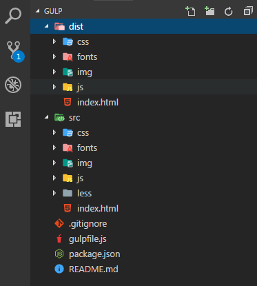

## gulp前端自动化构建工具

&emsp;&emsp;Gulp是基于Node.js的一个构建工具（自动任务运行器），开发者可以使用它构建自动化工作流程（前端集成开发环境）。一些常见、重复的任务，例如：网页自动刷新、CSS预处理、代码检测、压缩图片、等等…… 只需用简单的命令就能全部完成。使用它，可以简化工作，让你把重点放在功能开发上；同时减少人为失误，提高开发效率和项目质量，让专注更为专注。如果你之前接触过Grunt，那上手Gulp就会觉得非常容易理解。

&emsp;&emsp;github地址：[https://github.com/San-Shui/gulp](https://github.com/San-Shui/gulp)

&emsp;&emsp;gulp插件：[https://gulpjs.com/plugins/](https://gulpjs.com/plugins/)

&emsp;&emsp;本项目使用gulp-webserver创建一个静态服务器，gulp-livereload实现网页自动刷新；同时介绍常用的插件以及插件的使用。

 - 本地安装

要安装最新版本或特定版本，请运行以下命令之一：

>npm install --save-dev gulp

 - 全局安装

以下的 NPM 安装方式，将使 gulp 在全局环境下可用：

>npm install --global gulp

clone远程仓库到本地：
>git clone https://github.com/San-Shui/gulp.git

进入gulp目录
>cd gulp

安装依赖
> yarn install 或者 npm install 

运行项目

>gulp

运行之后会生成一个dist目录，dist目录下的文件是通过配置gulp自动生成。

修改src目录下的任何文件都会自动刷新网页

